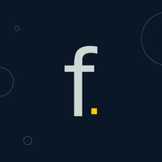

# First Kubernetes Application #

Welcome to the Core Concepts module!

This module takes you through the basics of Kubernetes. The architecture of a cluster incluiding Master (AKA control plane) and Worker nodes (AKA node):
In this module you will learn what is:

- Architecture of **The master Node**
  - **etcd**, what is a key-value store
  - **kube-api** server
  - **kube-controller** manager
  - **kube-scheduler** service

Architecture of **The Worker Node**
- **kubelet**
- **kubeproxy**
- **pods**

By going through this module you'll begin to understand the basics and get ready for a hands on lab in the following modules, isnt it fun?
------

Courious about DevOps, Open Source and Cloud technologies?   Check out our blog at  https://flugel.it/resources/blog/  
  

