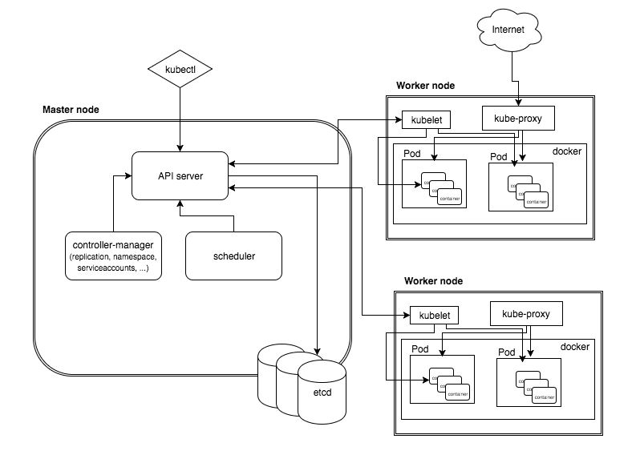
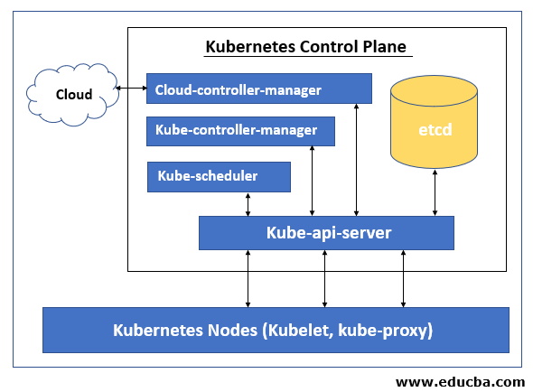

When you deploy Kubernetes, you get a cluster.

A Kubernetes cluster consists of a set of worker machines, called **nodes**, that run containerized applications. Every cluster has at least one worker node.

The **worker node(s)** host the Pods that are the components of the application workload. The **control plane manages** the worker nodes and the Pods in the cluster. In production environments, the **control plane** usually runs across multiple computers and a cluster usually runs multiple nodes, providing fault-tolerance and high availability.

## Kubernetes Components ##

Here's the diagram of a Kubernetes cluster with all the components tied together.


## Master Node

The control plane's components make global decisions about the cluster (for example, scheduling), as well as detecting and responding to cluster events (for example, starting up a new pod when a deployment's replicas field is unsatisfied).

Control plane components can be run on any machine in the cluster. However, for simplicity, set up scripts typically start all control plane components on the same machine, and do not run user containers on this machine.



The components of a Master Node are the following:

- **kube-apiserver** : Exposes the Kubernetes API
- **etcd: Kubernetes**:  Cluster Database for all cluster data.
- **kube-scheduler**: Watches for newly created Pods with no assigned node, and selects a node for them to run on.
- **kube-controller-manager**: Execute controller processes.
- **cloud-controller-manager**: Service that embeds cloud-specific control logic.

Let's get information about the Master Node. 

Execute the following command to get information about the Nodes in the cluster and their status.

`kubectl get nodes`{{execute}}

### Expected output
````
NAME           STATUS   ROLES    AGE   VERSION
controlplane   Ready    master   67s   v1.18.0
node01         Ready    <none>   39s   v1.18.0
````

Notice that there are two nodes running in this cluster, a Master Node (controlplane) and a Worker Node (node01).
The Master Node manages the cluster while the worker node runs the applications.

In cloud environments Nodes run on a Virtual Machine / Instance, that's why Kubernetes is not a Serverless technology.

### Dive deep into the Master Node

Let's run the following command to get information about the Master Node and the running components.

`kubectl describe node controlplane`{{execute}}

Notice that by running this command we get a lot of information about the current state of the cluster, including:

- Labels and Annotations: A really important attribute that will allow to handle different features of the cluster (will be covered later)
- Status of the cluster
- Resource allocation and capacity
- System info, including OS and version
- Namespaces and pods running the key components of the cluster
- Events

By running this command you will be able to troubleshoot your cluster whenever you face issues.

For additional details on the master node, please go to the following [URL]:(https://kubernetes.io/docs/concepts/overview/components/)